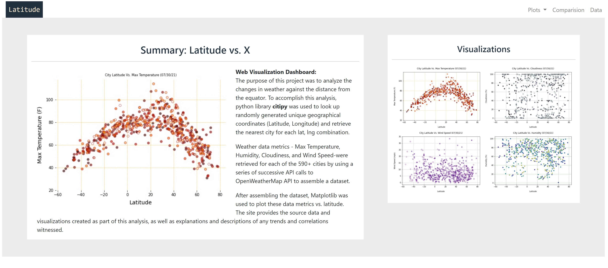
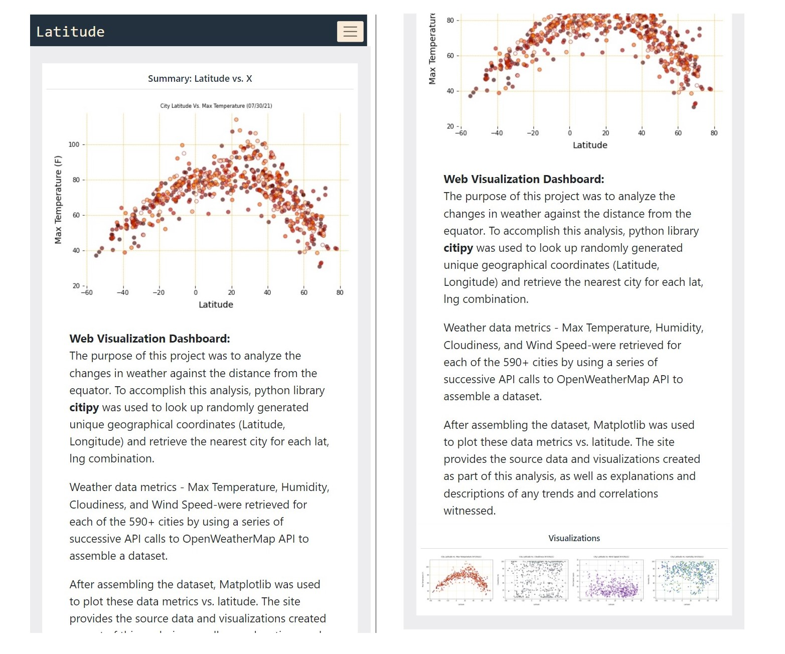
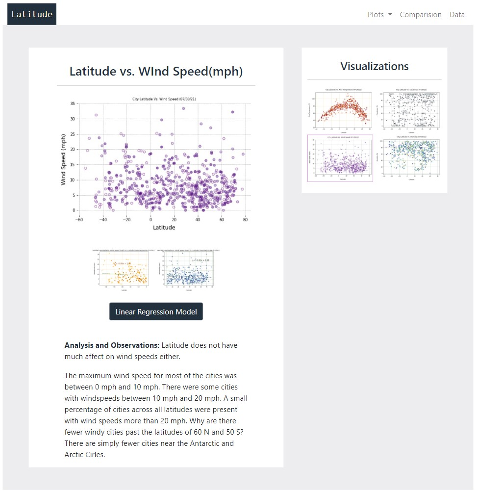
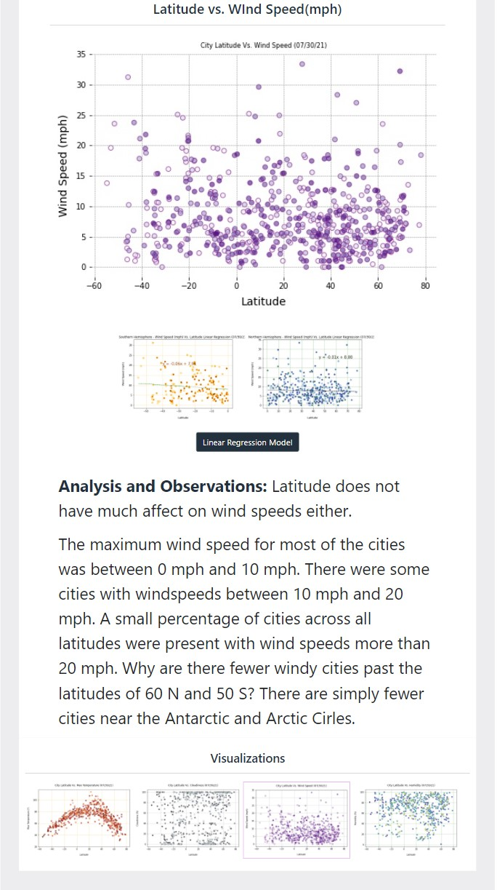

# Web-Design-Challenge - Web Visualization Dashboard (Latitude)

## Background

To create a dashboard showing the following analysis : 
 * To visualize the weather of 500+ cities across the world of varying distance from the equator by utilizing Python library - citipy, and the OpenWeatherMap API and to create a representative model of weather across world cities.

### Resources

1. All the files related to the website are in [WebVisualizations Folder](WebVisualizations/)

2. [WebVisualizations Folder](WebVisualizations/) also contains Images, Resourses, Visualizations as seperate folders.

3. The website has been deployed using GitHub pages.  

4. Site Link : https://v-malm.github.io/Web-Design-Challenge/WebVisualizations/

## Latitude - Latitude Analysis Dashboard with Attitude

Created a visualization dashboard website using visualizations by plotting [weather data for 07-30-2021](WebVisualizations/Resources/cities.csv).

In building this dashboard, individual pages were created for each plot and a means to navigate between them. These pages contain the visualizations and their corresponding explanations. The website has 7 pages 
 * A landing page
 * A page where we can see a comparison of all of the plots 
 * A page to view the data used to build the plots displayed on the website
 * 4 pages displaying each plot and related analysis
   * Button trigger modal to open Linear Regression Model for each visualization.

### Website pages

* A [landing page](#landing-page) containing:
  * An explanation of the project.
  * Links to each visualizations page. There is a sidebar containing preview images of each plot, and clicking an image takes the user to that visualization.
* Four [visualization pages](#visualization-pages), each with:
  * A descriptive title and heading tag.
  * The plot/visualization itself for the selected comparison.
  * A paragraph describing the plot and its significance.
* A ["Comparisons" page](https://v-malm.github.io/Web-Design-Challenge/comparisions.html) that:
  * Contains all of the visualizations on the same page so we can easily visually compare them.
  * Uses a Bootstrap grid for the visualizations.
    * The grid must be two visualizations across on screens medium and larger, and 1 across on extra-small and small screens.
* A ["Data" page](https://v-malm.github.io/Web-Design-Challenge/date.html) that:
  * Displays a responsive table containing the data used in the visualizations.
    * The table is a bootstrap table component.
    * The source is from exporting the `.csv` file as HTML by first using pandas to read the csv file to a dataframe and then using Pandas method `to_html` that generates an HTML table from the dataframe.

### Navigation

Site has navigation menu at the top of each page that:

* Has the name of the site on the left of the nav which allows users to return to the landing page from any page.
* Contains a dropdown menu on the right of the navbar named "Plots" that provides a link to each individual visualization page.
* Provides two more text links on the right: "Comparisons," which links to the comparisons page, and "Data," which links to the data page.
* Is responsive (using media queries). The background color changes when the screen is smaller.

### The website has been deployed to GitHub pages.
[Web Visualization Dashboard (Latitude)] (https://v-malm.github.io/Web-Design-Challenge/WebVisualizations) 

### Considerations

 * Created a Python script to visualize the weather of 500+ cities across the world of varying distance from the equator by utilizing Python library - citipy, and the OpenWeatherMap API, to create a representative model of weather across world cities.

 * The script does the following :

  * Randomly selects at least 500 unique (non-repeat) cities based on latitude and longitude.
  * Perform a weather check on each of the cities using a series of successive API calls.
  * Includes a print log of each city as it's being processed with the city number and city name.
  * Saves a CSV of all retrieved data and a PNG and JPEG image for each scatter plot.
  * Created a series of scatter plots to showcase the following relationships:
   
   * Temperature (F) vs. Latitude
   * Humidity (%) vs. Latitude
   * Cloudiness (%) vs. Latitude
   * Wind Speed (mph) vs. Latitude
   * The note book "WeatherPy.ipynb" has detailed explanation on what the code is analyzing.

* Created a linear regression on each relationship. Created seperate sets of plots for Northern Hemisphere and Southern Hemisphere:
  
  * Northern Hemisphere - Temperature (F) vs. Latitude
  * Southern Hemisphere - Temperature (F) vs. Latitude
  * Northern Hemisphere - Humidity (%) vs. Latitude
  * Southern Hemisphere - Humidity (%) vs. Latitude
  * Northern Hemisphere - Cloudiness (%) vs. Latitude
  * Southern Hemisphere - Cloudiness (%) vs. Latitude
  * Northern Hemisphere - Wind Speed (mph) vs. Latitude
  * Southern Hemisphere - Wind Speed (mph) vs. Latitude

* Used Bootstrap. 
  * This includes using the Bootstrap navbar component for the header on every page, the bootstrap table component for the data page, and the Bootstrap grid for responsiveness on the comparison page.
  * Deployed website to GitHub pages, with the website working on a live, publicly accessible URL as a result.
  * Used CSS media query for the navigation menu.
  * The website works at all window widths/sizes.

### Bonuses

* Generated the dataset for 7/30/21 
* Added extra visualizations using bootstrap 'Model'
* Visualization navigation on every visualizations page maintains an active state. 

### Screenshots

This section contains screenshots of each page, at varying screen widths.

#### <a id="landing-page">Landing page</a>
Large screen:

Small screen:

#### <a id="comparisons-page">Comparisons page</a>

Large screen:

Small screen:

#### <a id="data-page">Data page</a>

Large screen:

Small screen:

#### <a id="visualization-pages">Visualization pages</a>

One for each visualization. Here's an example of one:

Large screen:

Small screen:

#### Navigation menu

Large screen:

Small screen:
